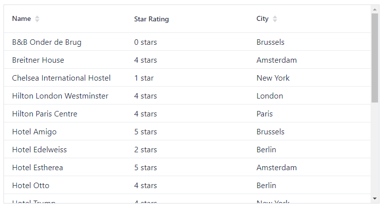

# Exercise 2 - Listing entities in a Grid

## Part 1 ##
Use the `Grid` component to visualize the list of accomodations.

Use `AccomodationService.getAccomodations()` to fetch the list of accomodations.

Use dot notation (city.name) to render the name of the city in the grid.
Use `Grid.setColumns()` to change the order of the columns.

## Part 2 ##
Disable auto-creation of columns in the `Grid` constructor.  
Add the columns manually using `Grid.addColumn()`.
Use `grid.addColumn(Renderer)` to render the star ratings as '5 stars' instead of the enum value.

## Extra ##
Render 1 star accomodations as '1 star' instead of '1 stars'.

