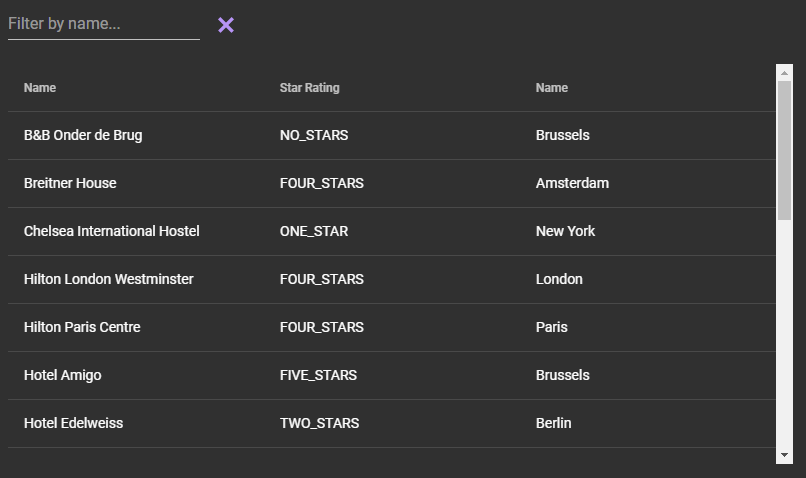

# Exercise 3 - Live filtering
Enhance the previous exercise by adding a filter `TextField` to provide live filtering on the accommodation name.

Also add a `Button` next to the filter field to clear the filter.

Notice the commented-out @Theme annotation in HomePage.java.
Try commenting it out.  This will render the application in the 'Material' theme, in the dark variant, instead of the default 'Lumo' theme.

