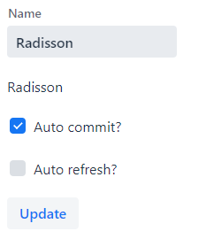

# Exercise 4 - Simple Field Binding
Create a TextField and a Span, both bound to the same 'MyFormData.name' property.

Add a button to update the Span with the value in the TextField.

Add an 'Auto commit'-checkbox to switch between 'buffered' and 'unbuffered' binding modes.
Auto commit = checked should mean 'unbuffered' mode.

* **Unbuffered mode:**    
  Use binder.setBean() and binder.getBean()  
* **Buffered mode:**  
  Use binder.writeBean() and binder.readBean()

Put a breakpoint in MyFormData.setName() to notice the difference in behaviour between these two modes.

**Extra credits:** 

Add an 'Auto refresh'-checkbox to hide the update button and make the nameSpan element auto-sync with the TextField.

