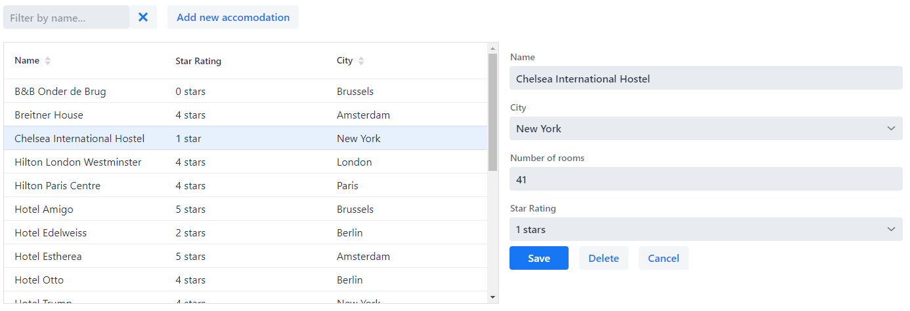

# Exercise 5 - Binding data to forms

## Part 1: Updating an existing Accomodation
Create an EditAccomodationForm component by writing a new class `EditAccomodationForm` extending `FormLayout`.

Add fields to this component for the following properties of Accomodation:
* Name
* City
* Number of rooms
* Star Rating

When the user clicks an element in the `Grid`, open the `EditAccomodationForm` and load the selected Accomodation.
Place the EditAccomodationForm component to the right of the grid, but only after an accomodation was selected in the 
grid.

Add a Save button to this form to update the entity when the user clicks it.
Use `AccomodationService.save()` to update the entity.

**Note 1:** Use `Binder.setBean()` to bind the Accomodation bean to the fields in the form.

**Note 2:** Use `NumberField` for the 'Number of rooms'-field.  Create a DoubleToIntegerConverter for converting from 
Double to Integer.  Use it when binding the numberOfRooms-field.

**Note 3:** Try to also bind using `Binder.readBean()` and `Binder.writeBean()` instead of `Binder.setBean()`.  
Using `Binder.setBean()` is also called binding in **unbuffered** mode.  Conversely binding using `Binder.readBean()` 
and `Binder.writeBean()` is called **buffered** mode.  
To understand the difference, set a breakpoint in the setter methods of `Accomodation` and try to find out when these 
breakpoints are reached when editing the fields in the form.

## Part 2: Adding a new Accomodation
Add a 'Add new accomodation button' that opens an empty `EditAccomodationForm` form to add a new Accomodation.

Create the new Accomodation when the save-button is clicked.
Use `AccomodationService.save()` to save the entity.

## Part 3: Deleting an Accomodation
Add a Delete button to delete the entity.

Use `AccomodationService.delete()` to delete the entity.

## Part 4: Add a cancel button
Add a Cancel button to the form that closes the form.

## Part 5: Notifications
Show notifications when adding, updating and deleting accomodations.
Use 

## Extra credits
Add a `DateField` to the form for the 'dateCreated' property of Accomodation.
Make this read-only.  Hide it when creating a new Accomodation.

[Relevant documentation](https://vaadin.com/docs/v14/flow/binding-data/tutorial-flow-components-binder-beans.html)