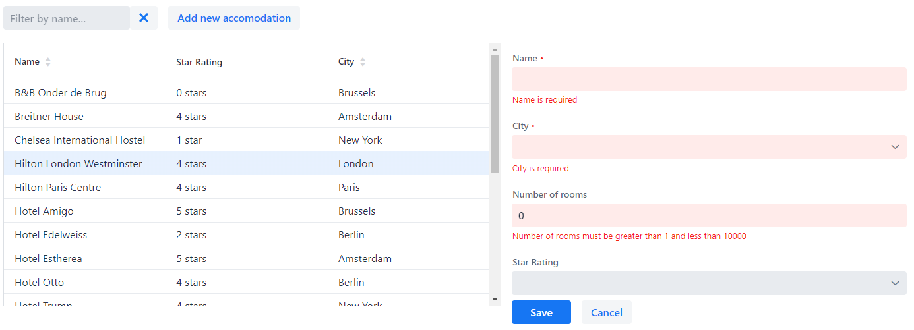

# Exercise 7 - Form validation

Add the following validation to the form:
* Name is required.
* City is required
* Number of rooms should be > 0 and < 10000

## Extra credits
Add the following validation to the form:
* Four and five star hotels should have at least 20 rooms.

**Tip:** You can use a `CommitHandler` on the `BeanFieldGroup` for this.

[Relevant documentation](https://vaadin.com/docs/v13/flow/binding-data/tutorial-flow-components-binder-validation.html)