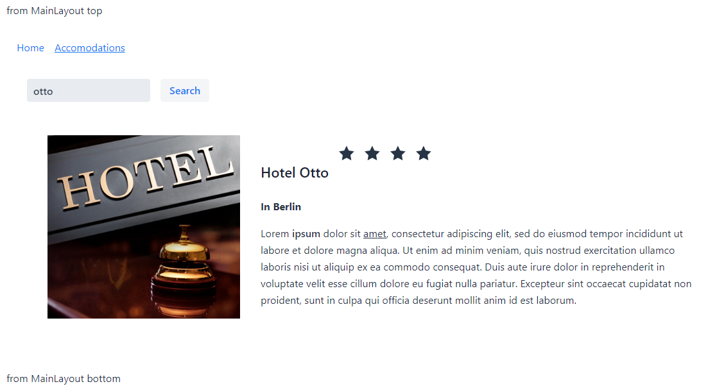

# Exercise 10 - Router Layout

In this exercise we will make a common layout with a header, a footer, and a top menu.  
Make the two views, HomePageView and SearchAccomodationView, use this common layout.

Structure the layouts as follows:
* Create a MainLayout that contains the header and footer part
* Create a LayoutWithMenuBar that has MainLayout as ParentLayout, and that adds the top menu, with links to the two views.
* Use LayoutWithMenuBar as the layout for the two views: HomePageView and SearchAccomodationView

The result should look somewhat like this (feel free to make it look nicer!):

**Tip:** Override `RouterLayout.showRouterLayoutContent(HasElement content)` to define where content should be placed within a layout.

## Relevant documentation
[Router Layouts and Nested Router Targets](https://vaadin.com/docs/v14/flow/routing/tutorial-router-layout.html)  
