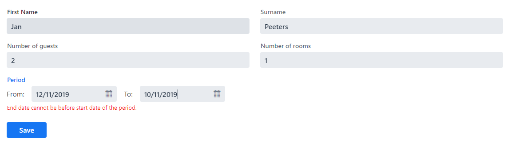
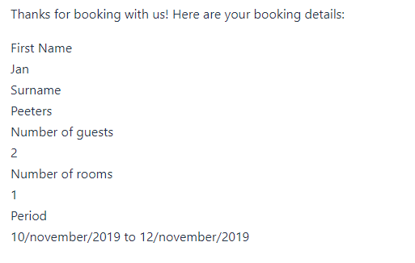

# Exercise 12 - Custom Fields

Create a custom `DateRangeField` to add the booking period to the booking form.
Add validation to the `DateRangeField` to check that the end date cannot be before the start date.

