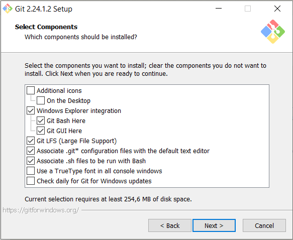
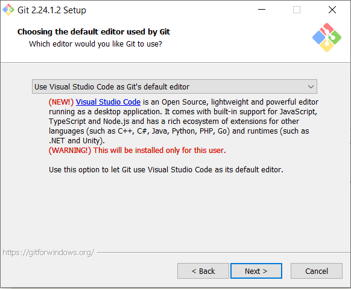
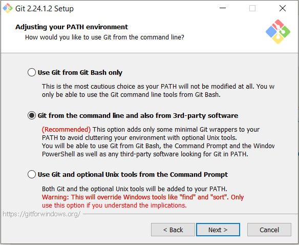
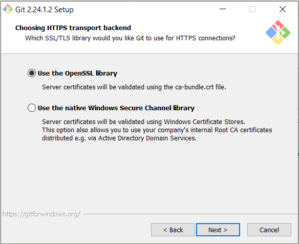
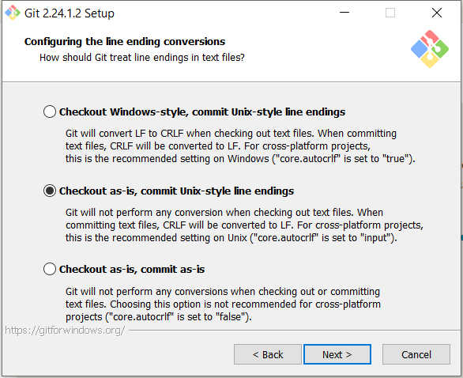
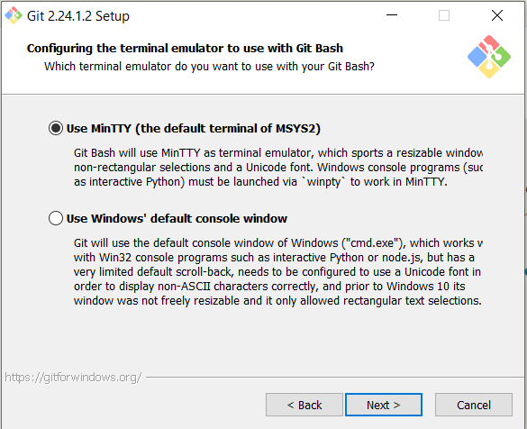
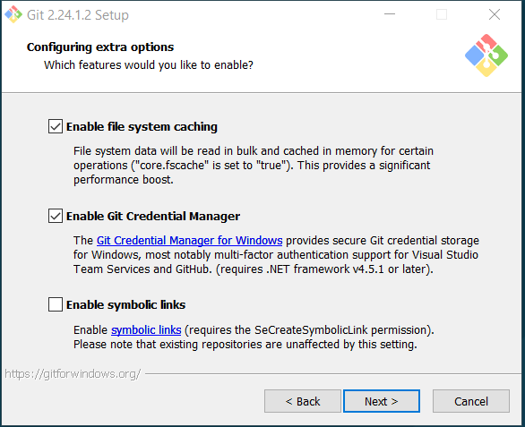

# Switchfully Setup & Software installation guide

## General Setup
> Let us create a consistent setup for the entire team: \
    We'll start with something simple ...

Create 2 folders

`C:\_development`\
`C:\_development\.programs`

> **_NOTE:_**  Why `_development` & `.programs`? \
    As a developper we want structure, control & avoid problems where possible.\
    The `_` folder will appear at the top (which is very convenient 🤠).

## Bookmark these URLs
What would a software developer be without internet connectivity?

Bookmark (and test) the following URLs
* https://switchfully.com/track/java/
* https://github.com/switchfully/track-shared
* https://github.com/switchfully/track-java
* https://switchfully.slack.com/

## Have a github account
This should already be the case! \
Turn it into an Educational account.

## Download & install Visual Studio Code
Great! Now you have Markdown supported!\
That means you can view this file in a propper way 😉\
Press `Ctrl+Shift+V` to see the magic in action.

> **_NOTE:_**  Shortcuts increase developer efficiency. \
    Although it should not be your focus during the setup of your laptop, do know that you work faster and more efficient when you use shortcuts.\
    Software development is hard, and shortcuts help to stay focussed.\
    And it will make you look like a codewizard! 🧙‍♂️🧙🏼‍♀️

## Git
Download & install Git: https://git-scm.com/download/win
> **_NOTE:_**  Please pay attention to the exact options you select while installing Git (and other software), so you have the same setup as the rest of the team.

Next: Make sure the user is correctly configured -> Use your *github* username (including the email used for github) and password.
    https://git-scm.com/book/en/v2/Getting-Started-First-Time-Git-Setup > Your identity (use your github information)

Test:\
`git --version`\
`git clone switchfully/track-shared`

Git Cheat Sheet https://github.github.com/training-kit/downloads/github-git-cheat-sheet.pdf

## Download and install (unzip) Java
> Multiple versions of Java exist, from different companies.\
    We use OpenJDK 13.
    
Browse to the OpenJDK website (https://jdk.java.net/13/) and download the JDK 13 zip file (the binaries, not the sources)\
-> https://download.java.net/java/GA/jdk13.0.1/cec27d702aa74d5a8630c65ae61e4305/9/GPL/openjdk-13.0.1_windows-x64_bin.zip\

Unzip it into `C:\_development\.programs`

> **_NOTE:_**  Unzip?? No install? \
    Indeed! You do not have to 'install' the OpenJDK java with a `*.exe`, just unzip it and **set the necessary environment variables** (`JAVA_HOME` & `PATH`).\
    Oracle, a company that sells a commercial version of java, provides both an installer and a zip file with binaries.
    
### Set the necessary environment variables
1. Setup `$JAVA_HOME`
    1. Go to `System Properties` or type `<windows-key>` + "environment variables"
    1. In the tab `Advanced` click `Environment Variables...`
    1. This screen is split in 2 parts (User variables & System variables)
    1. Create a new System Variable in called "JAVA_HOME", `C:\_development\.programs`

1. Setup your `$PATH` variable
    1. In the same screen.
    1. Edit `PATH`
    1. Add `%JAVA_HOME%\bin`

Test:\
`java --version`\
`javac --version`

## IntelliJ (ultimate)

    Install IntelliJ
    -> in Program files
    
    Activate IntelliJ
        1. Get an IntelliJ license through GitHub Education
        2. Download IntelliJ ultimate
        3. Install IntelliJ
        3. Start IntelliJ
        5. Activate the **free trial**
        9. Go to Help > Register
            - Fill in your username/e-mail and password of your intelliJ account
            - Activate the license (this should work)

    IntelliJ Cheat sheet
        https://resources.jetbrains.com/storage/products/intellij-idea/docs/IntelliJIDEA_ReferenceCard.pdf

## Maven
Download the maven binary zipfile (https://maven.apache.org/) & unzip it: `C:\_development\.programs`

Add the maven bin folder to the `$PATH` (in the same way as you did for the JDK)
    
Test:\
`mvn -v`

## Get started with the Switchfully java track
    ​
    1. Fork the java track: https://github.com/switchfully/track-java
    1. Clone your fork into C:\_Projects\switchfully
    1. Open your project with IntellIj: File -> Open -> Select the "track-java"-folder
    1. Configure your sdk
        1. Go to file > project structure (or press ctrl + alt + shift + s)
        1. Select the project menu on the left hand side
        1. Under "project sdk" press the new button
        1. Select the jdk folder in C:\_projects\.programs\java
        1. After that select your new jdk as the default jdk
        1. Set project language level to 12
    1. Download the settings.xml posted in slack
    1. Fill in your username and password in the downloaded settings.xml file (and don't forget to save afterwards)
    1. Copy the settings.xml file to C:\Users\\\<username>\\.m2\ (if there is already a settings.xml file there, override it)
    1. Go to intellij
        1. On the right-hand-side you have a M (maven) button. Click it.
        1. Click on reimport projects (its the button with the two arrows in a circle)
        1. You shouldn't get any error anymore

## Videoconferencing with Zoom
It's not (all) about code!\
It's about communication!

Download & install Zoom: https://zoom.us/client/latest/ZoomInstaller.exe

## Optional tools to install
> _(Without further instructions)_
* Postman
* SoapUI
* Node/NPM
* DBeaver

## Go Forth and Code
🚀 👩‍💻 👨‍💻 🎯 